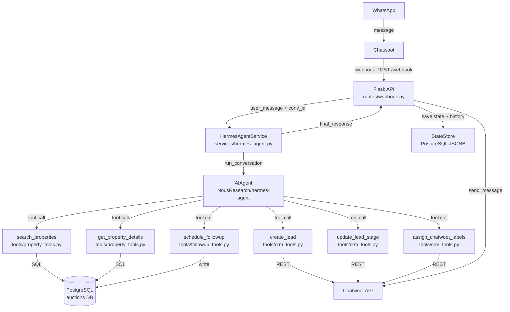
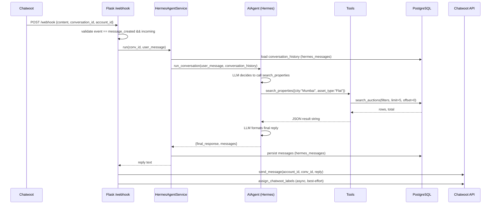
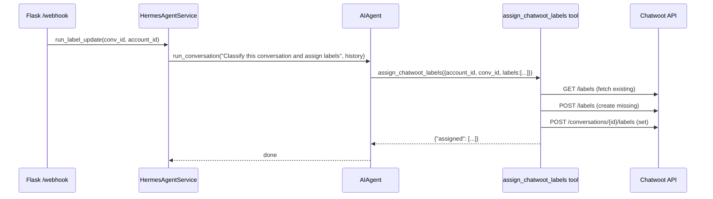

# Design Document: Hermes Agent Migration

## Overview

This document covers the migration of the existing real-estate AI chatbot from a
monolithic Flask + custom LLM intent engine to a Hermes Agent architecture (by Nous Research).
The core idea is incremental: the Flask webhook endpoint, PostgreSQL databases, and Chatwoot
integration stay exactly as-is, while the hand-rolled intent logic in `llm.py` and the ad-hoc
search/pagination state machine in `webhook.py` are replaced by a Hermes `AIAgent` instance
backed by purpose-built tools. The migration is delivered in five phases that each ship
independently without breaking the live system.

The result is a cleaner separation of concerns — Flask handles HTTP and Chatwoot I/O, Hermes
handles reasoning and tool dispatch, and each capability (property search, CRM labelling,
follow-up scheduling) is an isolated, testable tool that can be improved or extended without
touching the conversation loop.

---

## Architecture

### Current Architecture

```
WhatsApp → Meta Cloud API → Chatwoot → Flask webhook.py
                                           ↓
                               llm.py (decide_action)
                                           ↓
                          database.py (search_auctions)
                                           ↓
                          chatwoot.py (send_message / labels)
                                           ↓
                          state_store.py (JSONB state + message history)
```

### Target Architecture



### Component Responsibility Map

| Component | Owner | Changes |
|---|---|---|
| `routes/webhook.py` | Flask | Slim down: remove hand-rolled `handle_conversation`, delegate to `HermesAgentService` |
| `services/hermes_agent.py` | **New** | Wraps `AIAgent`; injects conversation history; returns final text |
| `services/llm.py` | Removed (Phase 3) | Replaced by Hermes + tool calls |
| `services/database.py` | Unchanged | Called by property tools |
| `services/state_store.py` | Unchanged (Phase 1–3) | Superseded by Hermes memory in Phase 4 |
| `services/chatwoot.py` | Unchanged | Called by CRM tools |
| `backend/tools/property_tools.py` | **New** | `search_properties`, `get_property_details` |
| `backend/tools/crm_tools.py` | **New** | `create_lead`, `update_lead_stage`, `assign_chatwoot_labels` |
| `backend/tools/followup_tools.py` | **New** | `schedule_followup` |

---

## Sequence Diagrams

### Normal Conversation Turn (Post-Migration)



### Label Update Flow (Async, Best-Effort)



---

## Components and Interfaces

### HermesAgentService

**Purpose**: Single integration point between Flask and the Hermes `AIAgent`. Owns conversation
history loading/saving, agent instantiation, and system prompt injection.

**Interface**:
```python
class HermesAgentService:
    def __init__(
        self,
        state_store: StateStore,
        model: str = "groq/llama-3.3-70b-versatile",
        max_iterations: int = 10,
    ) -> None: ...

    def run(
        self,
        conversation_id: str,
        user_message: str,
        account_id: int,
    ) -> str:
        """
        Load history, run one agent turn, persist messages, return final reply.
        Always returns a non-empty string (falls back to an apology on error).
        """
        ...

    def run_label_update(
        self,
        conversation_id: str,
        account_id: int,
    ) -> None:
        """
        Best-effort: ask the agent to classify the conversation and assign labels.
        Errors are swallowed and logged.
        """
        ...
```

**Responsibilities**:
- Instantiate `AIAgent` with `quiet_mode=True`, `skip_context_files=True`, `skip_memory=True` (Phase 1–3)
- Inject `REAL_ESTATE_SYSTEM_PROMPT` as `ephemeral_system_prompt`
- Pass `enabled_toolsets=["real_estate"]` to restrict tool access
- Convert `StateStore` message rows to Hermes `conversation_history` format
- Thread-safety: create a fresh `AIAgent` per request (Hermes requirement)

---

### PropertyTools

**Purpose**: Expose PostgreSQL auction search to the Hermes agent as callable tools.

**Interface**:
```python
def search_properties(
    city: str | None,
    asset_type: str | None,
    asset_category: str | None,
    institution: str | None,
    min_price: float | None,
    max_price: float | None,
    limit: int,
    offset: int,
) -> str:
    """
    Search the auctions database. Returns JSON string:
    {"results": [...], "total": int, "offset": int, "limit": int}
    Each result has: listing_id, city, asset_type, reserve_price,
    auction_date_time, institution, asset_details (truncated to 200 chars).
    On error: {"error": "message"}
    """
    ...

def get_property_details(listing_id: str) -> str:
    """
    Fetch full details for a single listing.
    Returns JSON string of all COLUMN_LABELS fields.
    On error: {"error": "message"}
    """
    ...
```

---

### CRMTools

**Purpose**: Expose Chatwoot CRM actions (labels, leads) as Hermes tools.

**Interface**:
```python
def assign_chatwoot_labels(
    account_id: int,
    conversation_id: str,
    labels: list[str],
) -> str:
    """
    Creates missing labels then sets them on the conversation.
    Returns JSON: {"assigned": [...], "created": [...]}
    On error: {"error": "message"}
    """
    ...

def create_lead(
    account_id: int,
    conversation_id: str,
    name: str | None,
    phone: str | None,
    intent: str | None,
    city: str | None,
    budget: str | None,
) -> str:
    """
    Persists lead metadata to hermes_leads table and optionally
    sets initial Chatwoot labels.
    Returns JSON: {"lead_id": str, "status": "created"}
    """
    ...

def update_lead_stage(
    conversation_id: str,
    stage: str,
    notes: str | None,
) -> str:
    """
    Updates lead stage in hermes_leads table.
    stage is one of: new_lead, qualified_lead, hot_lead, warm_lead, cold_lead.
    Returns JSON: {"updated": true, "stage": str}
    """
    ...
```

---

### FollowUpTools

**Purpose**: Schedule deferred re-engagement tasks stored in PostgreSQL.

**Interface**:
```python
def schedule_followup(
    conversation_id: str,
    account_id: int,
    delay_hours: int,
    note: str | None,
) -> str:
    """
    Inserts a row into hermes_followups with scheduled_at = NOW() + delay_hours.
    Returns JSON: {"followup_id": int, "scheduled_at": ISO8601 string}
    A separate worker process polls this table and sends follow-up messages.
    """
    ...
```

---

## Data Models

### hermes_leads (new table)

```sql
CREATE TABLE IF NOT EXISTS hermes_leads (
    id              UUID PRIMARY KEY DEFAULT gen_random_uuid(),
    conversation_id TEXT NOT NULL UNIQUE,
    account_id      INTEGER NOT NULL,
    name            TEXT,
    phone           TEXT,
    city            TEXT,
    budget          TEXT,
    intent          TEXT,
    stage           TEXT NOT NULL DEFAULT 'new_lead',
    notes           TEXT,
    created_at      TIMESTAMPTZ DEFAULT NOW(),
    updated_at      TIMESTAMPTZ DEFAULT NOW()
);
```

### hermes_followups (new table)

```sql
CREATE TABLE IF NOT EXISTS hermes_followups (
    id              SERIAL PRIMARY KEY,
    conversation_id TEXT NOT NULL,
    account_id      INTEGER NOT NULL,
    note            TEXT,
    scheduled_at    TIMESTAMPTZ NOT NULL,
    sent_at         TIMESTAMPTZ,
    status          TEXT NOT NULL DEFAULT 'pending'
);
CREATE INDEX IF NOT EXISTS idx_followups_scheduled
    ON hermes_followups (scheduled_at) WHERE status = 'pending';
```

### Existing tables (unchanged)

| Table | Role |
|---|---|
| `free_banks_auctions_stage_2_22_38_05_08_06_26` | Auction property data — read-only from tools |
| `hermes_conversations` | Per-conversation JSONB state — used by StateStore (Phases 1–3) |
| `hermes_messages` | Message history rows — used by StateStore and loaded into Hermes `conversation_history` |

---

## Recommended Folder Structure

```
backend/
├── app.py                          # unchanged
├── requirements.txt                # + hermes-agent @ git+...
├── Dockerfile
├── routes/
│   ├── __init__.py
│   └── webhook.py                  # slimmed down — delegates to HermesAgentService
├── services/
│   ├── __init__.py
│   ├── chatwoot.py                 # unchanged
│   ├── database.py                 # unchanged
│   ├── state_store.py              # unchanged (Phases 1–3), optional in Phase 4
│   ├── hermes_agent.py             # NEW — HermesAgentService wrapper
│   └── llm.py                      # REMOVED in Phase 3 (kept as fallback in Phase 2)
├── tools/                          # NEW directory — Hermes plugin tools
│   ├── __init__.py
│   ├── property_tools.py           # search_properties, get_property_details
│   ├── crm_tools.py                # create_lead, update_lead_stage, assign_chatwoot_labels
│   └── followup_tools.py           # schedule_followup
├── workers/
│   └── followup_worker.py          # NEW — polls hermes_followups, sends messages (Phase 5)
└── config/
    └── system_prompt.py            # NEW — REAL_ESTATE_SYSTEM_PROMPT constant
```

---

## Hermes Installation Plan

Hermes Agent is installed directly from GitHub (no PyPI stable release for embedding use):

```
# requirements.txt addition
hermes-agent @ git+https://github.com/NousResearch/hermes-agent.git
```

The tools in `backend/tools/` are Hermes **plugins** (not core built-ins), loaded via the plugin
discovery mechanism. They do not modify the Hermes source tree.

**Environment variables required**:

| Variable | Purpose |
|---|---|
| `OPENROUTER_API_KEY` | Hermes default provider (or use `GROQ_API_KEY` + `base_url`) |
| `GROQ_API_KEY` | If routing Groq directly via `base_url="https://api.groq.com/openai/v1"` |
| `DATABASE_URL` | Auction DB (already exists) |
| `STATE_DATABASE_URL` | State/messages DB (already exists) |
| `CHATWOOT_API_URL` | Chatwoot base URL (already exists) |
| `CHATWOOT_ACCESS_TOKEN` | Chatwoot token (already exists) |

**Hermes provider configuration** — Groq can be used as the LLM provider by setting:
```
base_url = "https://api.groq.com/openai/v1"
api_key  = GROQ_API_KEY
model    = "groq/llama-3.3-70b-versatile"
```
This preserves the existing Groq dependency and avoids an OpenRouter account requirement.

---

## Tool Definitions (JSON Schemas)

### search_properties

```json
{
  "name": "search_properties",
  "description": "Search the bank auction property database. Call this as soon as the user mentions any location, property type, budget, or intent to buy. Default to an empty filter search rather than asking more questions.",
  "parameters": {
    "type": "object",
    "properties": {
      "city": {
        "type": "string",
        "description": "City name, partial match accepted (e.g. 'Mumbai', 'Delhi')"
      },
      "asset_type": {
        "type": "string",
        "description": "Property type: Flat, House, Plot, Shop, Office, etc."
      },
      "asset_category": {
        "type": "string",
        "description": "Category: Residential, Commercial, Land, Industrial"
      },
      "institution": {
        "type": "string",
        "description": "Bank or financial institution name, partial match"
      },
      "min_price": {
        "type": "number",
        "description": "Minimum reserve price in INR (numeric, no symbols)"
      },
      "max_price": {
        "type": "number",
        "description": "Maximum reserve price in INR (numeric, no symbols)"
      },
      "limit": {
        "type": "integer",
        "description": "Number of results to return (default 5, max 10)",
        "default": 5
      },
      "offset": {
        "type": "integer",
        "description": "Pagination offset for fetching next page (default 0)",
        "default": 0
      }
    },
    "required": []
  }
}
```

### get_property_details

```json
{
  "name": "get_property_details",
  "description": "Fetch full details for a specific auction property by its listing ID. Use after the user selects a numbered result from a search.",
  "parameters": {
    "type": "object",
    "properties": {
      "listing_id": {
        "type": "string",
        "description": "The listing_id field from a previous search_properties result"
      }
    },
    "required": ["listing_id"]
  }
}
```

### create_lead

```json
{
  "name": "create_lead",
  "description": "Record a new lead when meaningful contact information or buying intent is captured. Call once per conversation when the user shows genuine interest.",
  "parameters": {
    "type": "object",
    "properties": {
      "account_id": {
        "type": "integer",
        "description": "Chatwoot account ID (provided in context)"
      },
      "conversation_id": {
        "type": "string",
        "description": "Chatwoot conversation ID (provided in context)"
      },
      "name": { "type": "string", "description": "User's name if mentioned" },
      "phone": { "type": "string", "description": "User's phone number if provided" },
      "intent": {
        "type": "string",
        "description": "User's intent: actively_looking, researching, investor, first_time_buyer"
      },
      "city": { "type": "string", "description": "Preferred city" },
      "budget": { "type": "string", "description": "Budget range as a string (e.g. '50L-1Cr')" }
    },
    "required": ["account_id", "conversation_id"]
  }
}
```

### update_lead_stage

```json
{
  "name": "update_lead_stage",
  "description": "Update the CRM stage of an existing lead as the conversation progresses.",
  "parameters": {
    "type": "object",
    "properties": {
      "conversation_id": {
        "type": "string",
        "description": "Chatwoot conversation ID"
      },
      "stage": {
        "type": "string",
        "enum": ["new_lead", "qualified_lead", "hot_lead", "warm_lead", "cold_lead"],
        "description": "New stage for the lead"
      },
      "notes": {
        "type": "string",
        "description": "Optional context note to persist with the stage update"
      }
    },
    "required": ["conversation_id", "stage"]
  }
}
```

### assign_chatwoot_labels

```json
{
  "name": "assign_chatwoot_labels",
  "description": "Assign CRM classification labels to the Chatwoot conversation. Creates labels that do not yet exist. Call after the main reply has been sent.",
  "parameters": {
    "type": "object",
    "properties": {
      "account_id": {
        "type": "integer",
        "description": "Chatwoot account ID"
      },
      "conversation_id": {
        "type": "string",
        "description": "Chatwoot conversation ID"
      },
      "labels": {
        "type": "array",
        "items": { "type": "string" },
        "description": "List of snake_case label strings (max 6). Examples: new_lead, mumbai, actively_looking, residential, high_budget, investor"
      }
    },
    "required": ["account_id", "conversation_id", "labels"]
  }
}
```

### schedule_followup

```json
{
  "name": "schedule_followup",
  "description": "Schedule a follow-up message to be sent to the user after a delay. Use when the user asks to be contacted later or when re-engagement is appropriate.",
  "parameters": {
    "type": "object",
    "properties": {
      "conversation_id": {
        "type": "string",
        "description": "Chatwoot conversation ID"
      },
      "account_id": {
        "type": "integer",
        "description": "Chatwoot account ID"
      },
      "delay_hours": {
        "type": "integer",
        "description": "Hours from now before sending the follow-up (e.g. 24 for tomorrow)",
        "minimum": 1,
        "maximum": 720
      },
      "note": {
        "type": "string",
        "description": "Context for the follow-up message (what was the user interested in?)"
      }
    },
    "required": ["conversation_id", "account_id", "delay_hours"]
  }
}
```

---

## Hermes Agent Configuration

### System Prompt (`config/system_prompt.py`)

```python
REAL_ESTATE_SYSTEM_PROMPT = """
You are Hermes, an AI assistant for Banksauctions.com helping users discover bank auction properties in India.

## Behaviour Rules
- Call search_properties as soon as the user gives ANY location, property type, price hint, or buying intent.
- Do NOT ask more than one clarifying question before searching. Prefer calling search_properties with partial filters over asking.
- When the user types a number (e.g. "3"), retrieve details for that result using get_property_details.
- When the user types "more" or "next", call search_properties again with a higher offset.
- After each substantive interaction, call assign_chatwoot_labels to keep the CRM updated.
- Use create_lead when the user shows genuine buying intent. Use update_lead_stage as intent signals change.
- Format WhatsApp messages with *bold* for property names and emoji section markers.

## Context Available Per Turn
- account_id and conversation_id are injected into your system context each turn.
- Do not ask the user for these values.

## Tool Use Priority
1. search_properties — primary action on any property query
2. get_property_details — on numeric selection
3. assign_chatwoot_labels — after every substantive reply (background)
4. create_lead / update_lead_stage — on intent signals
5. schedule_followup — only when user explicitly requests it or naturally defers
"""
```

### AIAgent Initialization (`services/hermes_agent.py`)

```python
from run_agent import AIAgent
from config.system_prompt import REAL_ESTATE_SYSTEM_PROMPT

def _make_agent(model: str, api_key: str, base_url: str | None, max_iterations: int) -> AIAgent:
    return AIAgent(
        model=model,
        api_key=api_key,
        base_url=base_url,          # e.g. "https://api.groq.com/openai/v1" for Groq direct
        quiet_mode=True,            # REQUIRED: suppress CLI spinner output
        skip_context_files=True,    # don't read AGENTS.md from filesystem
        skip_memory=True,           # don't use Hermes persistent memory (we manage our own)
        ephemeral_system_prompt=REAL_ESTATE_SYSTEM_PROMPT,
        enabled_toolsets=["real_estate"],  # whitelist our custom toolset only
        max_iterations=max_iterations,
        platform="whatsapp",        # hints agent to format output for mobile messaging
    )
```

---

## Low-Level Design

### Function Signatures

#### `services/hermes_agent.py`

```python
import logging
from run_agent import AIAgent
from services.state_store import StateStore
from config.system_prompt import REAL_ESTATE_SYSTEM_PROMPT

logger = logging.getLogger(__name__)

class HermesAgentService:
    def __init__(
        self,
        state_store: StateStore,
        model: str = "groq/llama-3.3-70b-versatile",
        api_key: str | None = None,
        base_url: str | None = None,
        max_iterations: int = 10,
    ) -> None:
        self._store = state_store
        self._model = model
        self._api_key = api_key
        self._base_url = base_url
        self._max_iterations = max_iterations

    def _history_to_hermes(self, rows: list[dict]) -> list[dict]:
        """Convert StateStore rows [{role, content}] to Hermes message format."""
        return [{"role": r["role"], "content": r["content"]} for r in rows]

    def _make_agent(self) -> AIAgent:
        return AIAgent(
            model=self._model,
            api_key=self._api_key,
            base_url=self._base_url,
            quiet_mode=True,
            skip_context_files=True,
            skip_memory=True,
            ephemeral_system_prompt=REAL_ESTATE_SYSTEM_PROMPT,
            enabled_toolsets=["real_estate"],
            max_iterations=self._max_iterations,
            platform="whatsapp",
        )

    def run(
        self,
        conversation_id: str,
        user_message: str,
        account_id: int,
    ) -> str:
        """
        Main entry point. Load history → run agent → persist → return reply.

        Preconditions:
          - conversation_id is a non-empty string
          - user_message is a non-empty string
          - account_id is a positive integer

        Postconditions:
          - Returns a non-empty string
          - New user + assistant messages appended to hermes_messages
          - On any exception: returns a safe fallback string, does not raise
        """
        try:
            history_rows = self._store.get_history(conversation_id, limit=20)
            hermes_history = self._history_to_hermes(history_rows)

            # Inject account_id / conversation_id into the user turn so tools can access them
            augmented_message = (
                f"[context: account_id={account_id}, conversation_id={conversation_id}]\n"
                f"{user_message}"
            )

            agent = self._make_agent()
            result = agent.run_conversation(
                user_message=augmented_message,
                conversation_history=hermes_history,
                task_id=conversation_id,
            )
            reply = result.get("final_response") or "I'm here to help. What are you looking for?"

            self._store.add_message(conversation_id, "user", user_message)
            self._store.add_message(conversation_id, "assistant", reply)
            return reply

        except Exception as exc:
            logger.exception("[HermesAgent] run() failed for conv=%s: %s", conversation_id, exc)
            return "Sorry, I encountered an error. Please try again."

    def run_label_update(
        self,
        conversation_id: str,
        account_id: int,
    ) -> None:
        """
        Best-effort label classification. Errors are logged and suppressed.

        Postconditions:
          - Chatwoot labels updated (if Chatwoot API reachable and agent succeeds)
          - Never raises
        """
        try:
            history_rows = self._store.get_history(conversation_id, limit=20)
            hermes_history = self._history_to_hermes(history_rows)
            agent = self._make_agent()
            agent.run_conversation(
                user_message=(
                    f"[context: account_id={account_id}, conversation_id={conversation_id}]\n"
                    "Based on this conversation, call assign_chatwoot_labels with the most "
                    "appropriate CRM labels. Max 6 labels. Do not reply with text, only call the tool."
                ),
                conversation_history=hermes_history,
                task_id=f"{conversation_id}-labels",
            )
        except Exception as exc:
            logger.warning("[HermesAgent] run_label_update() failed for conv=%s: %s", conversation_id, exc)
```

#### `tools/property_tools.py`

```python
import json
import os
import logging
from tools.registry import registry  # Hermes internal registry

logger = logging.getLogger(__name__)

# --- Handlers ---

def search_properties(
    city: str | None = None,
    asset_type: str | None = None,
    asset_category: str | None = None,
    institution: str | None = None,
    min_price: float | None = None,
    max_price: float | None = None,
    limit: int = 5,
    offset: int = 0,
) -> str:
    """
    Preconditions: limit ∈ [1, 10], offset ≥ 0
    Postconditions: returns valid JSON string with keys results/total/offset/limit OR error key
    Side effects: read-only DB query
    """
    from services.database import _get_shared_db  # late import to avoid circular deps
    db = _get_shared_db()
    filters = {
        k: v for k, v in {
            "city": city,
            "asset_type": asset_type,
            "asset_category": asset_category,
            "institution": institution,
            "min_reserve_price": min_price,
            "max_reserve_price": max_price,
        }.items() if v is not None
    }
    limit = max(1, min(limit, 10))
    try:
        rows, total = db.search_auctions(filters=filters, limit=limit, offset=offset)
        results = []
        for row in rows:
            d = dict(row)
            # Serialize dates
            for k, v in d.items():
                if hasattr(v, 'isoformat'):
                    d[k] = v.isoformat()
            # Truncate long text fields
            for field in ("asset_details", "asset_schedule", "asset_address"):
                if d.get(field) and len(str(d[field])) > 200:
                    d[field] = str(d[field])[:200] + "..."
            results.append(d)
        return json.dumps({"results": results, "total": total, "offset": offset, "limit": limit})
    except Exception as exc:
        logger.exception("search_properties failed: %s", exc)
        return json.dumps({"error": str(exc)})


def get_property_details(listing_id: str) -> str:
    """
    Preconditions: listing_id is a non-empty string
    Postconditions: returns JSON of all COLUMN_LABELS fields for the listing OR error
    Side effects: read-only DB query
    """
    from services.database import _get_shared_db, TABLE
    db = _get_shared_db()
    try:
        import psycopg2.extras
        with db.get_connection() as conn:
            with conn.cursor(cursor_factory=psycopg2.extras.RealDictCursor) as cur:
                cur.execute(
                    f"SELECT * FROM {TABLE} WHERE listing_id = %s LIMIT 1",
                    (listing_id,)
                )
                row = cur.fetchone()
        if not row:
            return json.dumps({"error": f"Listing {listing_id!r} not found"})
        d = dict(row)
        for k, v in d.items():
            if hasattr(v, 'isoformat'):
                d[k] = v.isoformat()
        return json.dumps(d)
    except Exception as exc:
        logger.exception("get_property_details failed: %s", exc)
        return json.dumps({"error": str(exc)})


# --- Schemas ---

SEARCH_PROPERTIES_SCHEMA = {
    "name": "search_properties",
    "description": (
        "Search the bank auction property database. Call this as soon as the user "
        "mentions any location, property type, budget, or buying intent."
    ),
    "parameters": {
        "type": "object",
        "properties": {
            "city":           {"type": "string",  "description": "City name, partial match accepted"},
            "asset_type":     {"type": "string",  "description": "Property type: Flat, House, Plot, Shop, Office"},
            "asset_category": {"type": "string",  "description": "Category: Residential, Commercial, Land"},
            "institution":    {"type": "string",  "description": "Bank name, partial match"},
            "min_price":      {"type": "number",  "description": "Minimum reserve price in INR"},
            "max_price":      {"type": "number",  "description": "Maximum reserve price in INR"},
            "limit":          {"type": "integer", "description": "Results per page (default 5, max 10)", "default": 5},
            "offset":         {"type": "integer", "description": "Pagination offset", "default": 0},
        },
        "required": [],
    },
}

GET_PROPERTY_DETAILS_SCHEMA = {
    "name": "get_property_details",
    "description": "Fetch full details for a specific auction listing by listing_id.",
    "parameters": {
        "type": "object",
        "properties": {
            "listing_id": {"type": "string", "description": "listing_id from a previous search_properties result"},
        },
        "required": ["listing_id"],
    },
}

# --- Registration ---

def _check_db() -> bool:
    return bool(os.getenv("DATABASE_URL"))

registry.register(
    name="search_properties",
    toolset="real_estate",
    schema=SEARCH_PROPERTIES_SCHEMA,
    handler=lambda args, **kw: search_properties(
        city=args.get("city"),
        asset_type=args.get("asset_type"),
        asset_category=args.get("asset_category"),
        institution=args.get("institution"),
        min_price=args.get("min_price"),
        max_price=args.get("max_price"),
        limit=args.get("limit", 5),
        offset=args.get("offset", 0),
    ),
    check_fn=_check_db,
    requires_env=["DATABASE_URL"],
    description="Search bank auction properties",
    emoji="🏠",
)

registry.register(
    name="get_property_details",
    toolset="real_estate",
    schema=GET_PROPERTY_DETAILS_SCHEMA,
    handler=lambda args, **kw: get_property_details(listing_id=args.get("listing_id", "")),
    check_fn=_check_db,
    requires_env=["DATABASE_URL"],
    description="Get full property listing details",
    emoji="📋",
)
```

#### `tools/crm_tools.py`

```python
import json
import os
import logging
from tools.registry import registry

logger = logging.getLogger(__name__)

def assign_chatwoot_labels(
    account_id: int,
    conversation_id: str,
    labels: list[str],
) -> str:
    """
    Preconditions: labels is a list of ≤6 snake_case strings; account_id > 0
    Postconditions: labels set on Chatwoot conversation; new labels created if missing
    Side effects: Chatwoot REST API calls (POST /labels, POST /conversations/{id}/labels)
    """
    from services.chatwoot import ChatwootClient
    client = ChatwootClient()
    try:
        existing = dict(client.get_all_labels(account_id))
        created = []
        for label in labels:
            if label not in existing:
                client.create_label(account_id, label)
                created.append(label)
        client.set_conversation_labels(account_id, conversation_id, labels[:6])
        return json.dumps({"assigned": labels[:6], "created": created})
    except Exception as exc:
        logger.exception("assign_chatwoot_labels failed: %s", exc)
        return json.dumps({"error": str(exc)})


def create_lead(
    account_id: int,
    conversation_id: str,
    name: str | None = None,
    phone: str | None = None,
    intent: str | None = None,
    city: str | None = None,
    budget: str | None = None,
) -> str:
    """
    Preconditions: account_id > 0, conversation_id non-empty
    Postconditions: row upserted in hermes_leads; returns lead_id
    Side effects: DB write to hermes_leads
    """
    from services.state_store import _get_shared_store
    store = _get_shared_store()
    try:
        lead_id = store.upsert_lead(
            conversation_id=conversation_id,
            account_id=account_id,
            name=name, phone=phone, intent=intent, city=city, budget=budget,
        )
        return json.dumps({"lead_id": str(lead_id), "status": "created"})
    except Exception as exc:
        logger.exception("create_lead failed: %s", exc)
        return json.dumps({"error": str(exc)})


def update_lead_stage(
    conversation_id: str,
    stage: str,
    notes: str | None = None,
) -> str:
    """
    Preconditions: stage ∈ {new_lead, qualified_lead, hot_lead, warm_lead, cold_lead}
    Postconditions: hermes_leads.stage updated; updated_at refreshed
    Side effects: DB write to hermes_leads
    """
    VALID_STAGES = {"new_lead", "qualified_lead", "hot_lead", "warm_lead", "cold_lead"}
    if stage not in VALID_STAGES:
        return json.dumps({"error": f"Invalid stage {stage!r}. Must be one of {sorted(VALID_STAGES)}"})
    from services.state_store import _get_shared_store
    store = _get_shared_store()
    try:
        store.update_lead_stage(conversation_id=conversation_id, stage=stage, notes=notes)
        return json.dumps({"updated": True, "stage": stage})
    except Exception as exc:
        logger.exception("update_lead_stage failed: %s", exc)
        return json.dumps({"error": str(exc)})


# Schemas and registration follow the same pattern as property_tools.py (omitted for brevity)
# Full schemas match the JSON schema definitions in the Tool Definitions section above.
```

#### `tools/followup_tools.py`

```python
import json
import os
import logging
from datetime import datetime, timezone, timedelta
from tools.registry import registry

logger = logging.getLogger(__name__)

def schedule_followup(
    conversation_id: str,
    account_id: int,
    delay_hours: int,
    note: str | None = None,
) -> str:
    """
    Preconditions:
      - delay_hours ∈ [1, 720]
      - conversation_id is non-empty
    Postconditions:
      - Row inserted into hermes_followups with status='pending'
      - scheduled_at = UTC now + delay_hours
    Side effects: DB write to hermes_followups
    Loop invariant: N/A (single INSERT)
    """
    delay_hours = max(1, min(int(delay_hours), 720))
    scheduled_at = datetime.now(tz=timezone.utc) + timedelta(hours=delay_hours)
    from services.state_store import _get_shared_store
    store = _get_shared_store()
    try:
        followup_id = store.insert_followup(
            conversation_id=conversation_id,
            account_id=account_id,
            note=note,
            scheduled_at=scheduled_at,
        )
        return json.dumps({
            "followup_id": followup_id,
            "scheduled_at": scheduled_at.isoformat(),
        })
    except Exception as exc:
        logger.exception("schedule_followup failed: %s", exc)
        return json.dumps({"error": str(exc)})
```

---

## Migration Roadmap

### Phase 1 — Install Hermes and Test Tools Locally (Week 1)

**Goal**: Hermes tools work in isolation; nothing in production changes.

Tasks:
1. Add `hermes-agent @ git+https://github.com/NousResearch/hermes-agent.git` to `requirements.txt`
2. Create `backend/tools/` directory with `property_tools.py`, `crm_tools.py`, `followup_tools.py`
3. Add `backend/config/system_prompt.py`
4. Write a standalone test script `scripts/test_tools.py` that instantiates tools directly and calls `search_properties`, `assign_chatwoot_labels`, etc. against the real dev DB
5. Validate tool JSON schema output manually
6. **Rollback**: nothing in production is touched; tools exist only on disk

**Success criteria**: `python scripts/test_tools.py` produces valid JSON results for all tools.

---

### Phase 2 — Integrate Hermes with Flask (Week 2)

**Goal**: `HermesAgentService` is wired into the webhook but runs in parallel with the existing `handle_conversation`. A feature flag controls which path is active.

Tasks:
1. Create `backend/services/hermes_agent.py` (`HermesAgentService` class)
2. Add `HERMES_ENABLED=false` environment variable
3. In `webhook.py`, add:
   ```python
   if os.getenv("HERMES_ENABLED", "false").lower() == "true":
       reply = hermes_agent_service.run(conversation_id, user_message, account_id)
   else:
       reply = handle_conversation(conversation_id, user_message, state)
   ```
4. Deploy with `HERMES_ENABLED=false` (no behaviour change)
5. Test locally with `HERMES_ENABLED=true` against a test WhatsApp number

**Rollback**: Set `HERMES_ENABLED=false` in `.env`, restart container.

---

### Phase 3 — Replace llm.py Intent Engine with Hermes (Week 3)

**Goal**: `HERMES_ENABLED=true` in production. `llm.py` removed (or kept as dead code).

Tasks:
1. Enable `HERMES_ENABLED=true` on staging, run full conversation test suite
2. Verify: property search, pagination ("more"), digit selection, label assignment
3. Remove the `HERMES_ENABLED` flag and old `handle_conversation` code path
4. Archive or delete `llm.py` (keep in git history)
5. Simplify `webhook.py` to call `hermes_agent_service.run()` directly

**Breaking change risk**: Low — the webhook contract (`POST /webhook`) is unchanged. The only observable difference is reply quality/style from Hermes vs the old Groq prompt.

**Rollback**: Git revert + redeploy (< 5 min).

---

### Phase 4 — Introduce Hermes Memory (Week 4)

**Goal**: Replace PostgreSQL JSONB state with Hermes native memory for richer cross-session context.

Tasks:
1. Set `skip_memory=False` on `AIAgent` (remove the override)
2. Configure Hermes memory backend to use the existing PostgreSQL instance
3. Migrate `hermes_conversations` JSONB state to Hermes memory format (one-time script)
4. Keep `hermes_messages` table as message log (Hermes writes its own conversation history too)
5. Monitor for duplicate state storage and clean up `StateStore` if redundant

**Risk**: Hermes memory schema may change between versions. Pin the `hermes-agent` git ref to a specific commit SHA in `requirements.txt` before this phase.

---

### Phase 5 — Autonomous Follow-Up Workflows (Week 5+)

**Goal**: Agent proactively re-engages users via scheduled follow-ups without human trigger.

Tasks:
1. Create `backend/workers/followup_worker.py` — polls `hermes_followups` every 5 minutes
2. For each due row: instantiate `HermesAgentService`, run a follow-up conversation turn with context from the note
3. Send reply via `chatwoot.send_message()`
4. Mark row `status='sent'`
5. Add `followup-worker` Docker service to `docker-compose.yml`

```yaml
# docker-compose.yml addition (Phase 5)
followup-worker:
  build:
    context: ./backend
  command: python workers/followup_worker.py
  env_file:
    - ./backend/.env
  depends_on:
    - postgres
    - backend
```

---

## Error Handling

### Tool Execution Errors

All tool handlers return `{"error": "message"}` JSON — never raise. The Hermes registry wraps
dispatch in a second try/except, so the agent always receives a string and can choose to
explain the error to the user or retry with different parameters.

### Agent Iteration Limit

`max_iterations=10` prevents runaway tool-calling loops (vs Hermes default of 90). A
10-iteration cap is generous for property search (typically 2–3 tool calls per turn) while
capping worst-case Groq token spend per request.

### Chatwoot API Failures

`run_label_update()` is fire-and-forget with full exception suppression. Label failures never
block the user reply.

### Database Connection Loss

`DatabaseService.get_connection()` reconnects on closed connections. Tool handlers catch all
exceptions and return structured error JSON.

---

## Risk Assessment and Breaking Changes

| Risk | Severity | Likelihood | Mitigation |
|---|---|---|---|
| Hermes `run_conversation` API changes between git commits | Medium | Medium | Pin to a specific commit SHA in `requirements.txt` after Phase 2 |
| Groq rate limits hit by Hermes multi-tool turns (each tool call = extra LLM round-trip) | Medium | Medium | Set `max_iterations=10`; use Groq batch endpoint if available |
| Tool registry import conflicts with Hermes built-in tools | Low | Low | Use namespaced toolset name `real_estate`; tools only registered when `enabled_toolsets=["real_estate"]` |
| `AIAgent` is not thread-safe (Hermes docs state one instance per thread) | High | High | Create a new `AIAgent` per request in `_make_agent()` — already addressed in design |
| `run_agent.py` import path changes (Hermes internal module, not a stable public API) | Medium | Low | Wrap import in `hermes_agent.py`; single file to update if path changes |
| Pagination state lost post-Phase 3 (old `state["results"]` list stored in JSONB) | Medium | Medium | Hermes agent handles pagination via `search_properties(offset=N)` natively; test before removing old code |
| Docker image size increase (hermes-agent has Node.js, ffmpeg, etc. in full install) | Low | Medium | Use `pip install hermes-agent` without `hermes postinstall` — Python library only, no Node/browser needed |
| WhatsApp message length limits (4096 chars) | Low | Low | Hermes `platform="whatsapp"` hint + system prompt instructs concise replies |

### No Breaking Changes to External Contracts

- `POST /webhook` endpoint: unchanged
- Chatwoot webhook source: unchanged
- PostgreSQL auction DB schema: unchanged
- `hermes_conversations` / `hermes_messages` tables: unchanged through Phase 3
- Docker Compose service names and ports: unchanged through Phase 4

---

## Testing Strategy

### Unit Testing Approach

Each tool handler is a pure function (modulo DB/HTTP calls) and should be tested in isolation
using mocks for `DatabaseService` and `ChatwootClient`.

Key unit test cases:
- `search_properties` with no filters returns results and correct pagination metadata
- `search_properties` with invalid `limit` (e.g. 0 or 999) is clamped to `[1, 10]`
- `get_property_details` with an unknown `listing_id` returns `{"error": ...}` not an exception
- `assign_chatwoot_labels` with more than 6 labels truncates to 6
- `update_lead_stage` with an invalid stage returns an error JSON without calling the DB
- `schedule_followup` with `delay_hours=0` is clamped to `delay_hours=1`
- `HermesAgentService.run()` returns a non-empty string even when `AIAgent` raises

### Property-Based Testing Approach

**Property Test Library**: `hypothesis` (Python)

Properties to fuzz:
- For any non-empty string `city` and non-negative `offset`, `search_properties` returns valid JSON
- For any `delay_hours` integer, `schedule_followup` always produces `scheduled_at` strictly after `NOW()`
- For any list of strings `labels`, `assign_chatwoot_labels` never assigns more than 6 labels
- For any `stage` string, `update_lead_stage` either succeeds with the stage in the response or returns an `{"error": ...}` — it never raises

### Integration Testing Approach

Integration tests run against a local PostgreSQL instance seeded with sample auction rows.

Key integration scenarios:
- Full conversation turn: user message → `HermesAgentService.run()` → tool call → DB query → formatted reply string
- Pagination: two sequential `search_properties` calls with `offset=0` and `offset=5` return non-overlapping result sets
- Label round-trip: `assign_chatwoot_labels` creates a new label in Chatwoot and then fetches it back via `get_all_labels`
- Follow-up worker: insert a `hermes_followups` row with `scheduled_at` in the past → worker picks it up and marks it `sent`

---

## Correctness Properties

*A property is a characteristic or behavior that should hold true across all valid executions of a system — essentially, a formal statement about what the system should do. Properties serve as the bridge between human-readable specifications and machine-verifiable correctness guarantees.*

### Property 1: Single reply per incoming message

*For any* incoming webhook event where `event == "message_created"` and `message_type == "incoming"`, exactly one reply is sent to Chatwoot and `HermesAgentService.run()` returns a non-empty string.

**Validates: Requirements 1.1, 1.4**

### Property 2: Webhook ignore contract

*For any* webhook POST where `event != "message_created"` OR `message_type != "incoming"`, no call is made to `ChatwootClient.send_message()` and the response body is `{"status": "ignored"}`.

**Validates: Requirements 1.2**

### Property 3: HermesAgentService never raises

*For any* `conversation_id`, `user_message`, and `account_id`, `HermesAgentService.run()` never raises an exception to its caller; all internal errors are caught, logged, and a non-empty fallback string is returned.

**Validates: Requirements 1.3, 1.4**

### Property 4: Agent instance isolation

*For any* two concurrent or sequential webhook requests, each call to `HermesAgentService.run()` creates a fresh `AIAgent` instance — no mutable agent state is shared between invocations.

**Validates: Requirements 1.5**

### Property 5: Search results structural invariant

*For any* combination of filter parameters, `search_properties` always returns a valid JSON string with keys `results`, `total`, `offset`, and `limit`, where `total >= len(results) >= 0` and `offset >= 0`.

**Validates: Requirements 2.1**

### Property 6: Search limit clamping

*For any* integer `limit` argument to `search_properties`, the value used in the database query and returned in the JSON response is always in the range `[1, 10]`.

**Validates: Requirements 2.2, 2.3**

### Property 7: Tools always return JSON

*For any* arguments passed to any registered Tool_Handler (including arguments that trigger internal exceptions), the handler always returns a valid JSON string parseable by `json.loads()` — never raises, never returns a raw dict.

**Validates: Requirements 2.7, 3.3, 3.8, 4.6, 8.1, 8.2**

### Property 8: Label count cap

*For any* `labels` list of any size passed to `assign_chatwoot_labels`, at most 6 labels are ever assigned to the Chatwoot conversation.

**Validates: Requirements 3.1**

### Property 9: Lead stage validation

*For any* `stage` string passed to `update_lead_stage`, the function either returns `{"updated": true, "stage": <value>}` for a valid stage or `{"error": ...}` for an invalid one — it never mutates the database on invalid input.

**Validates: Requirements 3.6, 3.7**

### Property 10: Follow-up scheduling temporal invariant

*For any* `delay_hours` value (after clamping to `[1, 720]`), `schedule_followup` always produces a `scheduled_at` timestamp strictly greater than the current UTC time at the moment of the call.

**Validates: Requirements 4.1, 4.4**

### Property 11: Follow-up delay clamping

*For any* integer `delay_hours` argument to `schedule_followup`, the delay used to compute `scheduled_at` is always clamped to the range `[1, 720]`.

**Validates: Requirements 4.2, 4.3**

### Property 12: Message history round-trip

*For any* conversation turn, after `HermesAgentService.run()` completes, calling `StateStore.get_history(conversation_id)` returns a history list that includes the user message and assistant reply from that turn.

**Validates: Requirements 6.6**

---

## Dependencies

| Package | Version | Purpose |
|---|---|---|
| `hermes-agent` | `git+https://github.com/NousResearch/hermes-agent.git` | Agent framework, tool registry, AIAgent class |
| `Flask` | `3.1.3` | HTTP server (unchanged) |
| `groq` | `0.28.0` | Groq SDK (kept for Phase 1–2 fallback; may be removed in Phase 3) |
| `psycopg2-binary` | `2.9.10` | PostgreSQL (unchanged) |
| `python-dotenv` | `1.2.2` | Env loading (unchanged) |
| `requests` | `2.34.2` | Chatwoot HTTP calls (unchanged) |

Hermes uses `httpx`, `pydantic`, and `openai` internally — these are pulled in transitively.
No version conflicts are expected with the existing Flask stack, but run `pip check` after
installation to verify.
